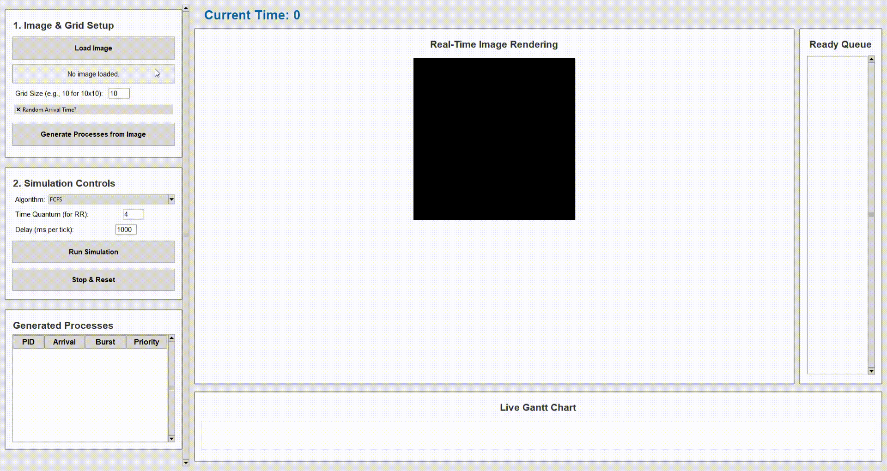

# Visual CPU Scheduling Simulator

This project is a desktop application, built with Python and Tkinter, that provides a unique and visual way to understand CPU scheduling algorithms.

Instead of simulating abstract processes with numbers, this application uses an image. The image is divided into a grid, and each grid block becomes a "process" (a "rendering task"). The application then runs a selected scheduling algorithm to "render" the image, block by block, providing a powerful visual representation of how different algorithms handle varying workloads.

## Demo



---

## Features

* **Visualize Classic Algorithms:** Supports **FCFS**, **SJF** (Shortest Job First), **Priority** (non-preemptive), and **Round Robin**.
* **Image-Based Process Generation:** Load any `.jpg` or `.png` image, and the app will generate "rendering tasks" based on a specified grid size (e.g., 10x10).
* **Dynamic Process Attributes:**
    * **Burst Time:** Automatically calculated based on the visual *complexity* (standard deviation of pixel values) of the image block. More complex blocks take longer to "render."
    * **Priority:** Automatically assigned based on the block's *distance from the center*. Central blocks are given higher priority (lower number).
    * **Arrival Time:** Choose between all processes arriving at $t=0$ or randomized arrival times for a more dynamic simulation.
* **Live Visualizations:**
    * **Real-Time Image Rendering:** Watch the image get rendered block by block on the main canvas. A "progress bar" overlay shows the remaining burst time for the currently running process.
    * **Live Gantt Chart:** A color-coded Gantt chart scrolls in real-time, showing the CPU's activity (which process is running or if it's idle).
    * **Dynamic Ready Queue:** See processes enter and leave the ready queue as the simulation progresses.
* **Interactive UI:**
    * The process table and Gantt chart are color-coded for easy tracking.
    * Click a process in the table to **highlight** its corresponding block on the image canvas.
    * Control simulation speed with an adjustable delay (in milliseconds).
    * FCFS is intelligently disabled when all processes arrive at $t=0$, as it's not a meaningful choice in that scenario.

---

## How to Run

1.  **Clone the repository:**
    ```sh
    git clone https://github.com/AhujaOm/OS-Scheduler-Simulator.git
    cd OS-Scheduler-Simulator
    ```

2.  **Install dependencies:**
    This project requires Python 3 and the **Pillow** (PIL) library for image processing. `Tkinter` is included with most Python installations.
    ```sh
    pip install requirement.txt
    ```

3.  **Run the application:**
    Save the provided code as `simulator.py` (or any name you prefer) and run it:
    ```sh
    python simulator.py
    ```

---

## How it Works

1.  **Load Image:** The user selects an image file.
2.  **Generate Processes:** The user specifies a grid size (e.g., 10) and clicks "Generate."
    * The app divides the image into an $N \times N$ grid (e.g., $10 \times 10 = 100$ blocks).
    * Each block becomes a process.
    * **Burst Time** is derived from the standard deviation of the grayscale pixel values in that block. A solid-color block will have a burst time of 1, while a complex, high-contrast block will have a much higher burst time.
    * **Priority** is calculated as the Euclidean distance from the center of the image.
    * **Arrival Time** is set to 0 for all processes or randomized, based on the user's choice.
3.  **Run Simulation:**
    * The user selects an algorithm (e.g., "Round Robin"), sets a time quantum, and a delay.
    * Upon clicking "Run," the simulation begins, advancing one time-tick at a time.
    * At each tick, the simulation checks for new arrivals, updates the ready queue, and assigns a process to the CPU based on the selected algorithm.
    * The image canvas and Gantt chart are updated in real-time to reflect the CPU's state.
4.  **Completion:** When all processes (image blocks) are complete, the simulation stops and displays the average waiting time and average turnaround time.

---

## Contributors

This project was a collaborative effort by:

* Om Ahuja - [AhujaOm](https://github.com/AhujaOm)
* Rikin Parekh - [RikinParekh15147](https://github.com/RikinParekh15147)
* Mit Darji - [mitkdarji](https://github.com/mitkdarji)
